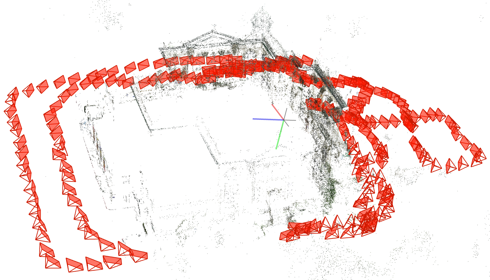
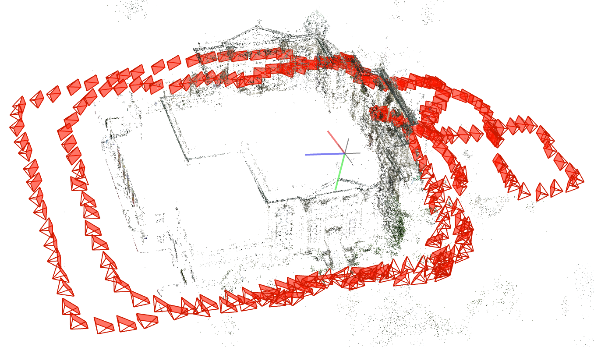

# colmap-priors

<p align="center">
  
  
</p>

<p align="center">
  <em>COLMAP GUI visualization of TanksAndTemples – Courthouse scene.</em><br/>
  Left: Baseline reconstruction · Right: Reconstruction with DA3 priors
</p>

`colmap_priors` is a **single-entry COLMAP pipeline** for running reconstructions on sequential scenes (e.g., Tanks-and-Temples \<SCENE>) and evaluating how **pose/position priors** from external models affect the resulting trajectory.

It supports:

- **Baseline**: standard COLMAP mapping (used as the reference gauge, if you want)
- **Pi3 priors**: export Pi3 poses → Sim(3) align to reference → inject pose priors → `pose_prior_mapper`
- **DA3 priors**: export DA3 centers (with window stitching) → Sim(3) align to reference → inject position priors → `pose_prior_mapper`
- **Evaluation plots**: per-comparison PNGs plus an additional *grid/raster* plot; optional per-image reprojection error coloring for `*_post` models, with **global color normalization** across all `kind="model"` plots

A deliberate design choice: the Python package itself depends only on **NumPy** + **Matplotlib**. Heavy dependencies (Torch / Pi3 / DA3) stay in their own venvs, and exporters are invoked via wrapper scripts.

---

## What this repo produces

For a \<SCENE>, the pipeline can produce:

- `colmap_baseline/` (optional)
- `pi3/` reconstruction and `pi3_predictions.npz`
- `da3/` reconstruction and `da3_predictions.npz`
- `plots/`:
  - one PNG per comparison (e.g., `pi3_pre`, `pi3_post`, `da3_pre`, `da3_post`)
  - one additional combined grid image (e.g., `2x2` for four plots)

`*_pre` plots visualize aligned predictions in the reference gauge.
`*_post` plots visualize the reconstructed COLMAP model after priors injection.

---

## Repo layout

- `src/colmap_priors/run_scene.py`
  - Orchestrates everything: DB creation, feature extraction, matching, optional baseline mapping, exporting predictions (via wrappers), alignment/injection, `pose_prior_mapper`, plots.

- `src/colmap_priors/export_poses.py`
  - Consolidated exporter logic for Pi3 and DA3.
  - Imports heavy dependencies lazily at runtime **inside the model venv**.

- `scripts/export_pi3_poses.py`, `scripts/export_da3_poses.py`
  - Thin wrappers that add this repo’s `src/` to `sys.path` and call `colmap_priors.export_poses:main_pi3` / `main_da3`.

- `scripts/export_poses.py`
  - Optional dispatcher that runs `pi3` / `da3` exporters using `PI3_PYTHON` / `DA3_PYTHON`.

- `src/colmap_priors/eval.py`
  - Plotting only (no duplicated Sim(3) logic).
  - Global reprojection-error colormap normalization across all `kind="model"` plots.
  - Adds `std=<PRIOR_POSITION_STD>` to plot titles.

---

## Prerequisites

### 1) COLMAP

You need a COLMAP build that provides the commands used by this pipeline:

- `colmap database_creator`
- `colmap feature_extractor`
- `colmap exhaustive_matcher`
- `colmap mapper`
- `colmap model_converter` (used by `model_to_txt`)
- `colmap pose_prior_mapper`

Verify on your machine:

```bash
colmap -h | head
colmap pose_prior_mapper -h
```

If `pose_prior_mapper` is missing, you must install/build a COLMAP version that includes it.

### 2) Python environment for the pipeline

The pipeline env should be lightweight. The recommended path is `uv`:

```bash
uv sync
```

This installs only `numpy` and `matplotlib` (plus build tooling).

### 3) Model environments (Pi3 and DA3)

Pi3 and DA3 should each live in their own checkout + venv (Torch, model code, weights, etc.).
You then point this pipeline to their Python interpreters:

- `PI3_PYTHON=/path/to/Pi3/.venv/bin/python`
- `DA3_PYTHON=/path/to/Depth-Anything-3/.venv/bin/python`

And their repo roots:

- `PI3_REPO=/path/to/Pi3`
- `DA3_REPO=/path/to/Depth-Anything-3`

The exporters use these repo paths to import the model modules.

---

## Data layout

Expected scene structure under `DATA_ROOT` (Tanks-and-Temples convention):

```text
DATA_ROOT/
  <SCENE>/
    images/
      000000.jpg
      000001.jpg
      ...
    sparse/
      0/
        cameras.bin
        images.bin
        points3D.bin
```

The `sparse/0` folder is optional if you set `RUN_BASELINE_MAP=1` and let the baseline reconstruction become the reference gauge.

---

## Quick start

1) Configure `scripts/colmap_priors.env`

Copy and edit the template:

```bash
cp scripts/colmap_priors.env scripts/colmap_priors.local.env
$EDITOR scripts/colmap_priors.local.env
```

2) Run the pipeline:

```bash
uv sync
uv run colmap-priors <SCENE> --env scripts/colmap_priors.local.env
```

Artifacts will be written under `EXP_ROOT/<SCENE>/`.

---

## Configuration

The pipeline reads simple `KEY=VALUE` pairs from the `--env` file.

### Required keys

- `DATA_ROOT` – path containing the scene folders
- `EXP_ROOT` – where outputs are written
- `PRIOR_POSITION_STD` – standard deviation used in `pose_prior_mapper` (also shown in plot titles)

### Common optional keys

- `COLMAP_EXE` – override `colmap` binary name/path (default: `colmap`)
- `REF_MODEL_DIR` – explicit reference model directory (e.g., `${DATA_ROOT}/<SCENE>/sparse/0`)
  - If unset and `RUN_BASELINE_MAP=1`, the baseline model is used as reference

- `MAX_IMAGES` – if >0, uniformly subsample images and run on that subset

- Toggles:
  - `RUN_BASELINE_MAP` (0/1)
  - `RUN_PI3` (0/1)
  - `RUN_DA3` (0/1)
  - `RUN_PLOT` (0/1)

- Pi3 exporter knobs:
  - `PI3_INTERVAL` (default `1`)

- DA3 exporter knobs:
  - `DA3_WINDOW` (default `10`)
  - `DA3_OVERLAP` (default `6`)
  - `DA3_AUTocast` (0/1, default `1`)

---

## Exporters (standalone)

You can run exporters without the full pipeline.

### Using the dispatcher

```bash
python scripts/export_poses.py --env scripts/colmap_priors.local.env pi3 -- --image_dir /path/to/images --output /tmp/pi3.npz
python scripts/export_poses.py --env scripts/colmap_priors.local.env da3 -- --image_dir /path/to/images --output /tmp/da3.npz --window 10 --overlap 6 --autocast
```

### Calling wrappers directly

```bash
${PI3_PYTHON} scripts/export_pi3_poses.py --image_dir ... --output ...
${DA3_PYTHON} scripts/export_da3_poses.py --image_dir ... --output ...
```

---

## Output structure

A typical output tree (under `EXP_ROOT/<SCENE>/`) looks like:

```text
EXP_ROOT/<SCENE>/
  image_list.txt
  base.db
  colmap_baseline/
    sparse/0/ ...
    sparse/0_txt/ cameras.txt images.txt points3D.txt
  pi3/
    database.db
    pi3_predictions.npz
    sparse/0/ ...
    sparse/0_txt/ ...
  da3/
    database.db
    da3_predictions.npz
    sparse/0/ ...
    sparse/0_txt/ ...
  plots/
    trajectories.png
    trajectories_grid.png
    ... (one PNG per comparison)
```

`base.db` is the feature/match database copied for the Pi3/DA3 runs. Each model run uses its own `database.db` so that priors injection does not affect the baseline DB.
